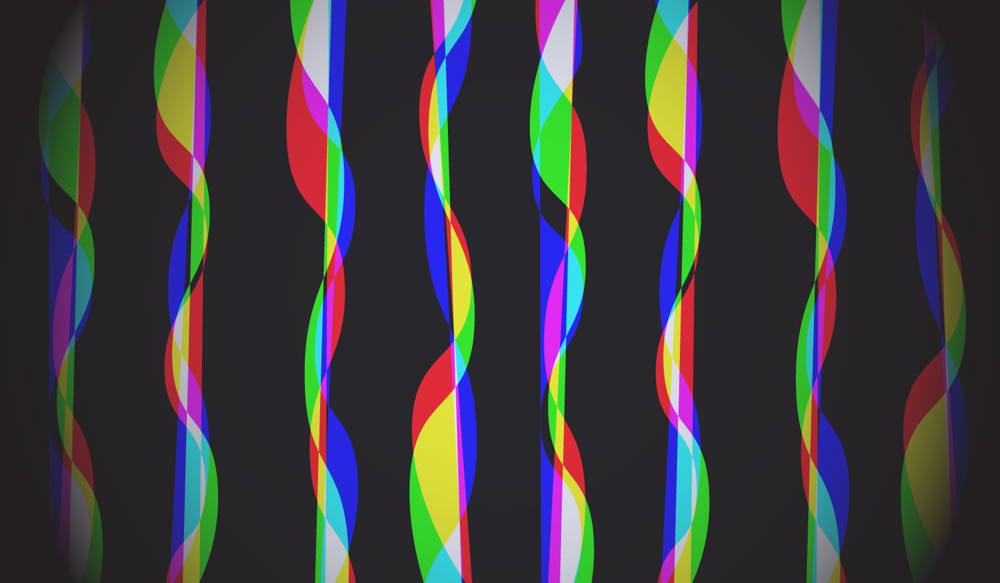

# Multitouch Fabric

[![License][license-img]][license-url]

The capstone project of Janette Hernandez (Electrical Engineering BSc) and Maria Contreras (Electrical Engineering BSc), a smart fabric that can respond to touch input.

The Multitouch Fabric is composed of several components:

- Resistive Thread
- Non-Conductive Thread
- Neoprene
- Eeonyx 
- Perfboards
- Adafruit METRO Mini

The design consists of three different layers. In order to distinguish between all three layers, we will call the bottom layer **Rows**, middle layer **Eeonyx**, and the top layer **Columns**.

The **Rows** are composed of 4, *4.5 inch* rows of conductive thread facing up with non-conductive thread facing below. 

The **Eeonyx** is a resistive fabric that its electrical resistance decreases under mechanical stress, such as pressures. This fabric possesses surface resistance between 10 Ohm/sq and 10 billion Ohm/sq.

The **Columns** are composed of 4, 4 ½ inch rows of conductive thread facing down with non-conductive thread facing up.

These three layers are sandwiched together, where the Columns and Rows are connected to pins 4-11 on the METRO Mini. 

Pins 8-11 will read (digitalRead) which will either read 1 or 0 (High or Low) on the serial monitor.        

To showcase the project [Alain Galvan (Computer Science MSc)](https://twitter.com/alainxyz) developed a visualizer program for the project.

[license-img]: http://img.shields.io/:license-mit-blue.svg?style=flat-square
[license-url]: https://opensource.org/licenses/MIT
