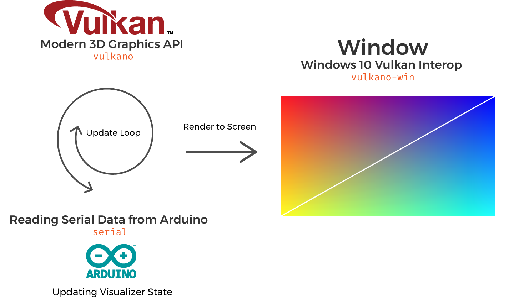

# Fabric Visualizer

👗🌋 A visualizer app for our multitouch fabric technology. 

Depending on where the user touches the fabric, a corresponding synth tone will play, blending between *square* and *sin* tones along the Y axis with the tone generated from Vulkan.

The visualization uses raymarching to render modulating curves that vibrate and change shape according to the position of the user's fingers.

## Data Flow

During the application update loop data from the Arduino is read from the serial port, and passed to uniform buffers in Vulkan, and we show the next image in the swapchain. 
